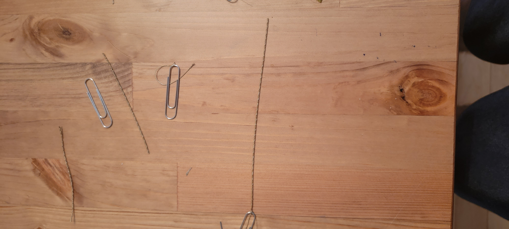

# ChessRobot

## Overview 

The robot module is responsible for making the moves on the physical board. 

The initial version of the robot will be made using a hybrid of hard and soft robotics. The arm will be made using servos and the hand will be made using artificial muscle fibers (https://www.youtube.com/watch?v=gzdZGKHdfsc). The final version of the robot, which we plan on completing by the end of summer 2022, will have no servos and be built entirely using artificial muscle fibers. 

